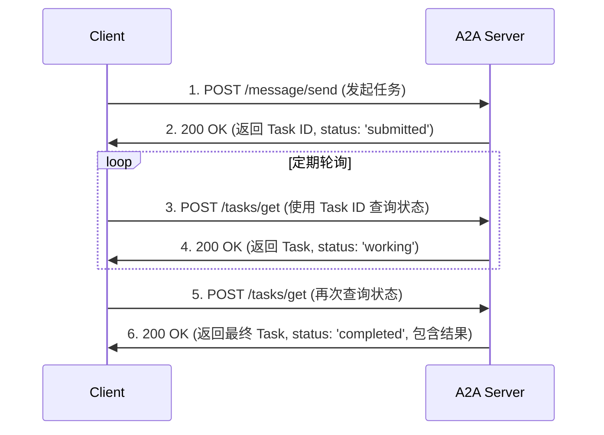
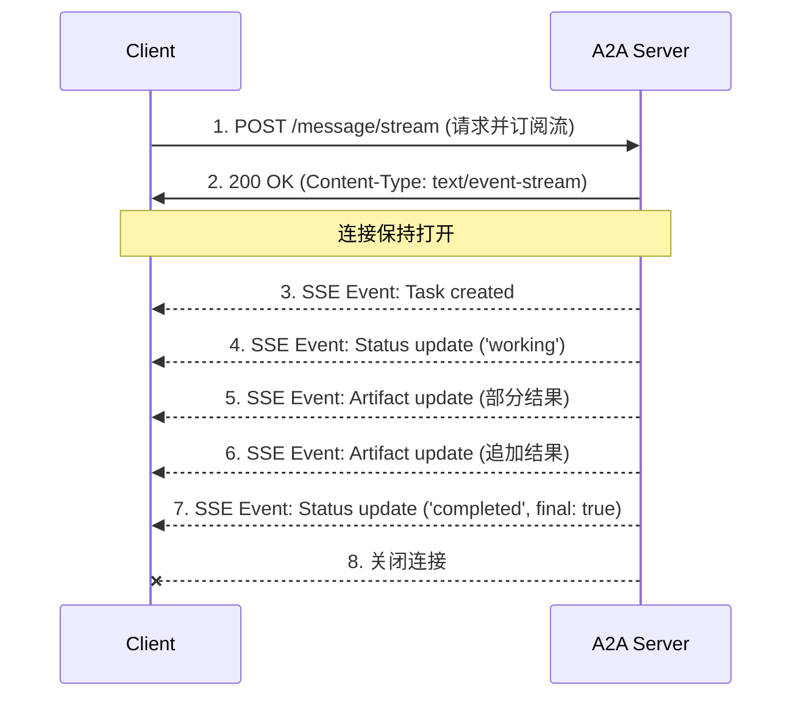
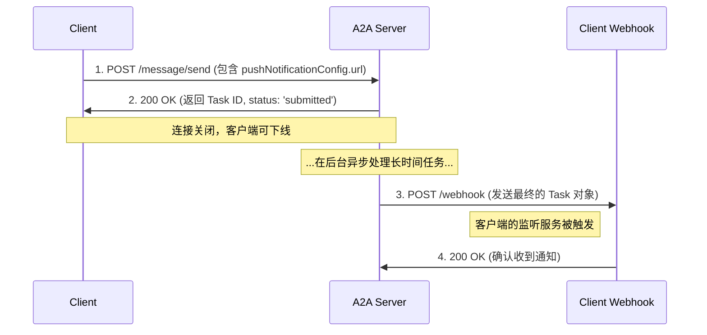

# A2A 协议的三种主要通信方式总结

- **作者**: Gemini
- **更新日期**: 2025-07-23

A2A 协议定义了三种核心的通信方式，以适应不同的交互场景，从快速响应到需要实时反馈和长时间运行的后台任务。

---

## 1. 同步请求/响应 (Synchronous Request/Response)

这是最基础的交互模式，类似于传统的 Web API 调用。

- **适用场景**: 适用于那些可以快速完成、能立即返回结果的请求，或者客户端愿意通过轮询来等待结果的场景。
- **核心方法**: `message/send`, `tasks/get`

### 详细交互流程

1.  **客户端发起请求**:
    -   客户端向服务端的 A2A 端点发送一个 HTTP POST 请求，其 body 是一个 JSON-RPC 对象，`method` 为 `message/send`。
    -   这个请求中包含一个 `Message` 对象，里面是用户的请求内容。

    **请求体示例 (`POST /message/send`)**
    ```json
    {
      "jsonrpc": "2.0",
      "id": "req-1",
      "method": "message/send",
      "params": {
        "message": {
          "role": "user",
          "parts": [
            {
              "kind": "text",
              "text": "为我的新咖啡店想一个名字。"
            }
          ],
          "messageId": "msg-123"
        }
      }
    }
    ```

2.  **服务端处理并响应**:
    -   如果任务需要一些时间，服务端会立即返回一个初始的 `Task` 对象，其 `id` 已被创建，但状态可能是 `submitted` 或 `working`。

    **响应体示例**
    ```json
    {
      "jsonrpc": "2.0",
      "id": "req-1",
      "result": {
        "id": "task-abc",
        "contextId": "ctx-xyz",
        "status": {
          "state": "submitted",
          "timestamp": "2025-07-23T10:00:00Z"
        },
        "artifacts": [],
        "history": [],
        "kind": "task"
      }
    }
    ```

3.  **客户端获取结果 (轮询)**:
    -   客户端使用上一步获取的 `Task ID`，定期调用 `tasks/get` 方法来轮询任务的最新状态。

    **请求体示例 (`POST /tasks/get`)**
    ```json
    {
      "jsonrpc": "2.0",
      "id": "req-2",
      "method": "tasks/get",
      "params": {
        "id": "task-abc"
      }
    }
    ```

4.  **服务端返回中间状态**:
    -   如果任务仍在进行中，服务端会返回当前状态。

    **响应体示例**
    ```json
    {
      "jsonrpc": "2.0",
      "id": "req-2",
      "result": {
        "id": "task-abc",
        "contextId": "ctx-xyz",
        "status": {
          "state": "working",
          "timestamp": "2025-07-23T10:00:05Z"
        },
        "artifacts": [],
        "history": [],
        "kind": "task"
      }
    }
    ```

5.  **客户端再次轮询并获取最终结果**:
    -   当任务完成后，`tasks/get` 的响应将包含最终状态和结果工件。

    **响应体示例 (任务完成)**
    ```json
    {
      "jsonrpc": "2.0",
      "id": "req-3",
      "result": {
        "id": "task-abc",
        "contextId": "ctx-xyz",
        "status": {
          "state": "completed",
          "timestamp": "2025-07-23T10:00:10Z"
        },
        "artifacts": [
          {
            "artifactId": "art-001",
            "name": "suggested_names",
            "parts": [
              {
                "kind": "text",
                "text": "1. 磨豆时光\n2. 啡常想你\n3. 城市之光咖啡馆"
              }
            ]
          }
        ],
        "history": [],
        "kind": "task"
      }
    }
    ```

### 流程图



---

## 2. 流式传输 (Streaming via Server-Sent Events - SSE)

这种方式允许服务端在一个持久的 HTTP 连接上，持续地向客户端发送事件流。

- **适用场景**: 需要实时反馈进度的场景。例如，当代理在生成一篇长文档时，可以逐字或逐句地将内容流式传输给客户端。
- **核心方法**: `message/stream`

### 详细交互流程

1.  **客户端发起请求**:
    -   客户端发送一个 HTTP POST 请求，`method` 为 `message/stream`。

    **请求体示例 (`POST /message/stream`)**
    ```json
    {
      "jsonrpc": "2.0",
      "id": "req-stream-1",
      "method": "message/stream",
      "params": {
        "message": {
          "role": "user",
          "parts": [
            {
              "kind": "text",
              "text": "写一首关于宇宙的短诗。"
            }
          ],
          "messageId": "msg-456"
        }
      }
    }
    ```

2.  **服务端建立流式连接**:
    -   服务端响应一个 HTTP `200 OK`，`Content-Type` 头为 `text/event-stream`，并保持连接打开。

3.  **服务端推送事件**:
    -   服务端开始通过这个连接发送一系列 SSE 事件。每个事件的 `data` 字段都是一个 JSON-RPC 响应对象。

    **SSE 事件 1: 任务创建**
    ```json
    data: {"jsonrpc":"2.0","id":"req-stream-1","result":{"id":"task-stream-def","contextId":"ctx-stream-uvw","status":{"state":"submitted"},"kind":"task"}}
    ```

    **SSE 事件 2: 状态更新**
    ```json
    data: {
      "jsonrpc": "2.0",
      "id": "req-stream-1",
      "result": {
        "taskId": "task-stream-def",
        "status": {
          "state": "working"
        },
        "kind": "status-update"
      }
    }
    ```

    **SSE 事件 3: 工件更新 (部分结果)**
    ```json
    data: {
      "jsonrpc": "2.0",
      "id": "req-stream-1",
      "result": {
        "taskId": "task-stream-def",
        "artifact": {
          "artifactId": "art-poetry-1",
          "parts": [
            {
              "kind": "text",
              "text": "深邃夜空挂，"
            }
          ]
        },
        "append": false,
        "lastChunk": false,
        "kind": "artifact-update"
      }
    }
    ```

    **SSE 事件 4: 工件更新 (追加结果)**
    ```json
    data: {
      "jsonrpc": "2.0",
      "id": "req-stream-1",
      "result": {
        "taskId": "task-stream-def",
        "artifact": {
          "artifactId": "art-poetry-1",
          "parts": [
            {
              "kind": "text",
              "text": "星辰眨着眼。"
            }
          ]
        },
        "append": true,
        "lastChunk": true,
        "kind": "artifact-update"
      }
    }
    ```

    **SSE 事件 5: 任务完成**
    ```json
    data: {
      "jsonrpc": "2.0",
      "id": "req-stream-1",
      "result": {
        "taskId": "task-stream-def",
        "status": {
          "state": "completed"
        },
        "final": true,
        "kind": "status-update"
      }
    }
    ```

4.  **服务端关闭连接**:
    -   发送 `final: true` 的事件后，服务端关闭 SSE 连接。

### 流程图



---

## 3. 异步推送通知 (Asynchronous Push Notifications via Webhook)

这是为长时间运行的任务设计的。客户端发起请求后就可以完全断开连接，等待服务端的回调。

- **适用场景**: 非常耗时的后台任务，如生成复杂的分析报告、训练模型、或需要人工审批的流程。
- **核心方法**: `message/send` + `PushNotificationConfig`

### 详细交互流程

1.  **客户端发起请求并提供回调地址**:
    -   客户端在调用 `message/send` 时，额外提供一个 `pushNotificationConfig` 对象，其中包含一个客户端自己暴露的 Webhook URL。

    **请求体示例 (`POST /message/send`)**
    ```json
    {
      "jsonrpc": "2.0",
      "id": "req-async-1",
      "method": "message/send",
      "params": {
        "message": {
          "role": "user",
          "parts": [
            {
              "kind": "text",
              "text": "请生成上个季度的销售报告，这可能需要几个小时。"
            }
          ],
          "messageId": "msg-789"
        },
        "configuration": {
          "pushNotificationConfig": {
            "url": "https://my-client-app.com/webhook/a2a-updates",
            "token": "secret-token-for-validation"
          }
        }
      }
    }
    ```

2.  **服务端确认任务并断开连接**:
    -   服务端接收任务，记录下 Webhook URL，然后立即返回确认，并关闭 HTTP 连接。

    **响应体示例**
    ```json
    {
      "jsonrpc": "2.0",
      "id": "req-async-1",
      "result": {
        "id": "task-async-ghi",
        "contextId": "ctx-async-pqr",
        "status": {
          "state": "submitted",
          "timestamp": "2025-07-23T11:00:00Z"
        },
        "kind": "task"
      }
    }
    ```

3.  **服务端完成任务并发起回调**:
    -   几小时后，当任务在后台完成时，服务端会向客户端提供的 Webhook URL 发起一个 HTTP POST 请求。

    **回调请求体示例 (`POST https://my-client-app.com/webhook/a2a-updates`)**
    ```json
    {
      "id": "task-async-ghi",
      "contextId": "ctx-async-pqr",
      "status": {
        "state": "completed",
        "timestamp": "2025-07-23T15:30:00Z"
      },
      "artifacts": [
        {
          "artifactId": "art-report-1",
          "name": "Q2_Sales_Report.pdf",
          "parts": [
            {
              "kind": "file",
              "file": {
                "mimeType": "application/pdf",
                "uri": "https://storage.a2a-server.com/reports/q2_report.pdf?token=..."
              }
            }
          ]
        }
      ],
      "kind": "task"
    }
    ```

4.  **客户端的 Webhook 接收并处理通知**:
    -   客户端的 Webhook 服务接收到这个 POST 请求，验证 `token`，然后处理 `Task` 结果。

### 流程图


